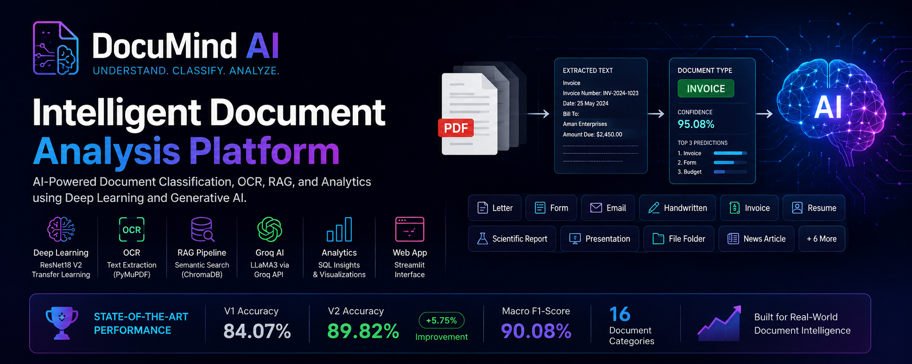
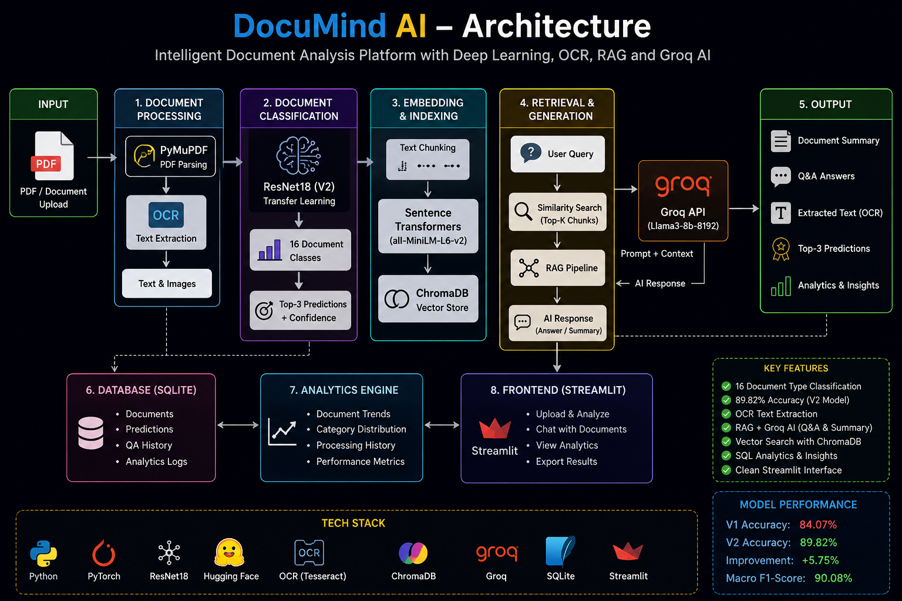
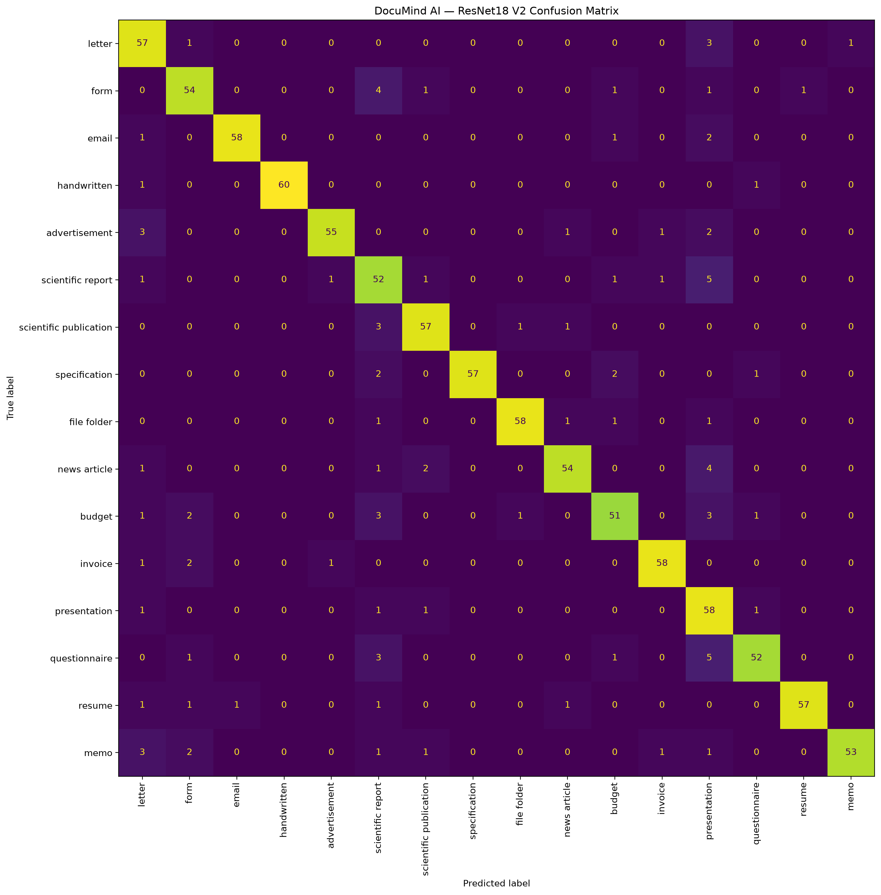
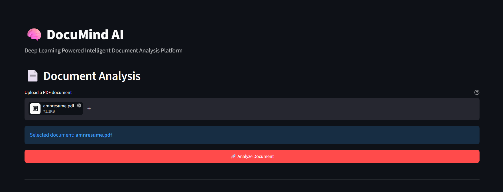
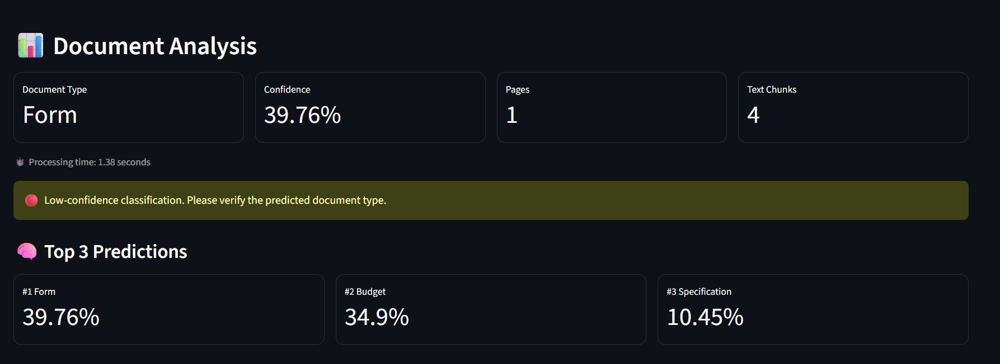
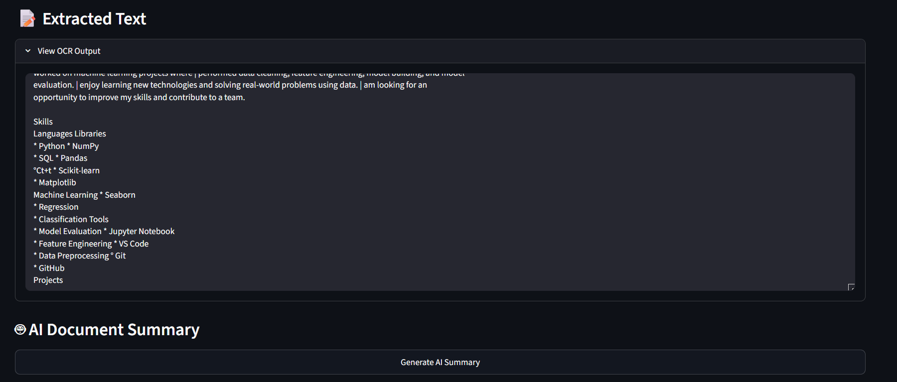
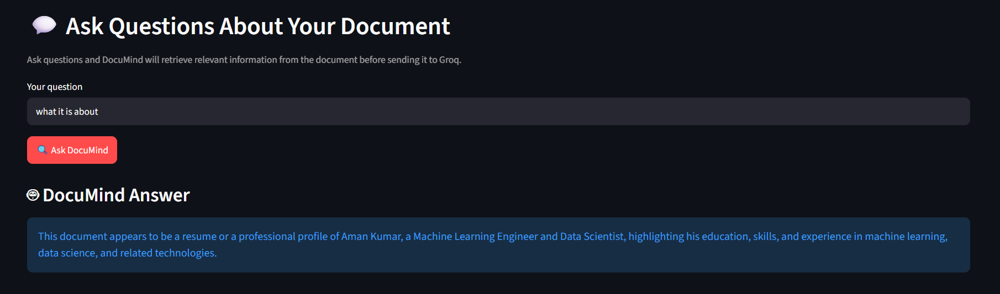
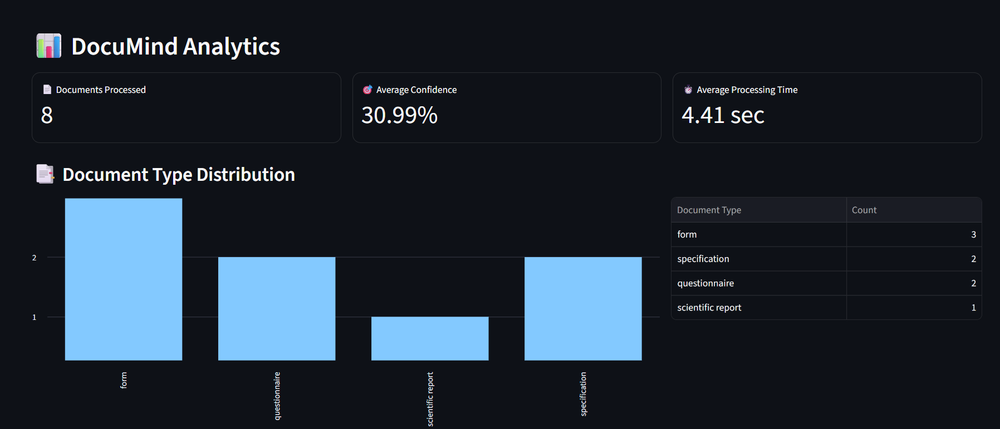

::: {align="center"}{=html}

<h1>

🧠 DocuMind AI

</h1>

<strong>{=html}Intelligent Document Analysis Platform powered by DeepLearning, OCR, RAG and Groq</strong>{=html}

{=html}{=html}{=html}{=html}{=html}{=html}

<strong>{=html}16 Document Classes</strong>{=html}  • <strong>{=html}89.82% Accuracy</strong>{=html}  • <strong>{=html}90.08% Macro F1</strong>{=html}

:::

📌 Overview

DocuMind AI is an end-to-end document intelligence platform thatcombines deep learning, OCR, semantic search, Retrieval-AugmentedGeneration (RAG), and LLMs to analyze documents intelligently.

The platform can:

📄 Upload and process PDF documents

🧠 Classify documents into 16 categories using a fine-tunedResNet18

🔢 Return top-3 document predictions with confidence scores

👁️ Extract text using OCR

🔎 Convert document text into embeddings and perform semanticretrieval

🤖 Generate document summaries using Groq LLMs

💬 Answer questions using document-grounded RAG

🗄️ Store processing history in SQLite

📊 Display document analytics through Streamlit

✨ Features

<table>

<tr>

<td width="50%">

🧠 Deep Learning

ResNet18 transfer learning

16 document categories

CUDA GPU acceleration

Top-3 predictions

Confidence-aware classification

Model evaluation with precision, recall and F1

</td>

<td width="50%">

🤖 Generative AI

OCR text extraction

Sentence-transformer embeddings

Chroma vector database

Retrieval-Augmented Generation

Groq-powered document Q&A

AI document summarization

</td>

</tr>

<tr>

<td width="50%">

📊 Analytics

SQLite document history

Total documents processed

Average confidence

Processing time

Document-type distribution

Processing history table

</td>

<td width="50%">

🖥️ Application

Streamlit interface

PDF upload

Real-time processing

GPU inference

Error handling

Modular Python architecture

</td>

</tr>

</table>

🏗️ System Architecture

::: {align="center"}{=html}:::

                         ┌─────────────────────┐
                         │     PDF Upload      │
                         └──────────┬──────────┘
                                    │
                                    ▼
                         ┌─────────────────────┐
                         │  PDF Processing     │
                         │      + OCR          │
                         └──────────┬──────────┘
                                    │
                    ┌───────────────┴───────────────┐
                    │                               │
                    ▼                               ▼
          ┌──────────────────┐            ┌──────────────────┐
          │  ResNet18 V2     │            │  Extracted Text  │
          │ Document Class.  │            └────────┬─────────┘
          └────────┬─────────┘                     │
                   │                               ▼
                   │                     ┌──────────────────┐
                   │                     │ Text Chunking    │
                   │                     └────────┬─────────┘
                   │                              │
                   │                              ▼
                   │                     ┌──────────────────┐
                   │                     │   Embeddings     │
                   │                     └────────┬─────────┘
                   │                              │
                   │                              ▼
                   │                     ┌──────────────────┐
                   │                     │   Chroma DB      │
                   │                     └────────┬─────────┘
                   │                              │
                   │                              ▼
                   │                     ┌──────────────────┐
                   │                     │      RAG         │
                   │                     └────────┬─────────┘
                   │                              │
                   └──────────────┬───────────────┘
                                  ▼
                         ┌─────────────────────┐
                         │      Groq LLM       │
                         └──────────┬──────────┘
                                    │
                         ┌──────────┴──────────┐
                         ▼                     ▼
                    AI Summary             Document Q&A
                         │                     │
                         └──────────┬──────────┘
                                    ▼
                         ┌─────────────────────┐
                         │   SQLite Analytics  │
                         └──────────┬──────────┘
                                    ▼
                         ┌─────────────────────┐
                         │ Streamlit Dashboard │
                         └─────────────────────┘

📂 Supported Document Categories

The classifier recognizes 16 document categories:

\# Category

 1 Letter
 2 Form
 3 Email
 4 Handwritten
 5 Advertisement
 6 Scientific Report
 7 Scientific Publication
 8 Specification
 9 File Folder
10 News Article
11 Budget
12 Invoice
13 Presentation
14 Questionnaire
15 Resume
16 Memo

🧠 Deep Learning Model

DocuMind uses ResNet18 transfer learning for document imageclassification.

Training improvements

The V2 model was improved over the original baseline using:

Data augmentation

Random resized cropping

Random rotation

Brightness/contrast augmentation

Dropout

Label smoothing

AdamW optimizer

Weight decay

Cosine learning-rate scheduling

Best-validation-model checkpointing

V1 → V2 improvement

Metric                    V1             V2

Architecture        ResNet18       ResNet18Training images        8,000          8,000Epochs                     3              5Accuracy              84.07%     89.82%Improvement              ---   +5.75 pp

📈 Model Evaluation

The V2 model achieved:

::: {align="center"}

<table>

<tr>

<th>

Metric

</th>

<th>

Score

</th>

</tr>

<tr>

<td>

<strong>{=html}Accuracy</strong>{=html}

</td>

<td>

<strong>{=html}89.82%</strong>{=html}

</td>

</tr>

<tr>

<td>

Macro Precision

</td>

<td>

90.86%

</td>

</tr>

<tr>

<td>

Macro Recall

</td>

<td>

89.82%

</td>

</tr>

<tr>

<td>

Macro F1

</td>

<td>

<strong>{=html}90.08%</strong>{=html}

</td>

</tr>

</table>

:::

Classification Performance

Document Class             Precision   Recall   F1-Score

Letter                        80.28%   91.94%     85.71%Form                          85.71%   87.10%     86.40%Email                         98.31%   93.55%     95.87%Handwritten                  100.00%   96.77%     98.36%Advertisement                 96.49%   88.71%     92.44%Scientific Report             72.22%   83.87%     77.61%Scientific Publication        90.48%   91.94%     91.20%Specification                100.00%   91.94%     95.80%File Folder                   96.67%   93.55%     95.08%News Article                  93.10%   87.10%     90.00%Budget                        87.93%   82.26%     85.00%Invoice                       95.08%   93.55%     94.31%Presentation                  68.24%   93.55%     78.91%Questionnaire                 92.86%   83.87%     88.14%Resume                        98.28%   91.94%     95.00%Memo                          98.15%   85.48%     91.38%

Confusion Matrix

::: {align="center"}{=html}:::

🖥️ Application Screenshots

Main Dashboard

::: {align="center"}{=html}:::

Document Classification

::: {align="center"}{=html}:::

OCR + AI Analysis

::: {align="center"}{=html}:::

Document Q&A

::: {align="center"}{=html}:::

Analytics Dashboard

::: {align="center"}{=html}:::

Screenshot setup: Place your images in assets/screenshots/ usingthe filenames above. If you use different filenames, simply update thecorresponding  paths.

🛠️ Tech Stack

Technology              Purpose

Python                  Core developmentPyTorch                 Deep learningResNet18                Document classificationCUDA                    GPU accelerationPyMuPDF                 PDF processingTesseract OCR           Text extractionTransformers            Text embeddingsSentence Transformers   Semantic embeddingsChroma                  Vector databaseRAG                     Context-aware retrievalGroq                    LLM inferenceLangChain               LLM/RAG integrationSQLite                  Persistent analytics/historyStreamlit               Web applicationuv                      Python environment/package managementGit/GitHub              Version control

📁 Project Structure

DocuMind-AI/
│
├── app.py
├── init_db.py
├── test_pipeline.py
├── test_prediction.py
│
├── pyproject.toml
├── uv.lock
├── README.md
├── .gitignore
│
├── assets/
│   ├── banner.png
│   ├── architecture.png
│   └── screenshots/
│       ├── dashboard.png
│       ├── classification.png
│       ├── analysis.png
│       ├── qa.png
│       └── analytics.png
│
├── src/
│   ├── __init__.py
│   ├── train.py
│   ├── predict.py
│   ├── evaluate.py
│   ├── classifier.py
│   ├── pipeline.py
│   ├── document_processor.py
│   ├── rag.py
│   ├── groq_client.py
│   └── database.py
│
├── models/
│   ├── document_classifier_v2.pth
│   ├── class_names.json
│   └── evaluation/
│       ├── confusion_matrix.png
│       └── classification_report.txt
│
└── data/

⚙️ Installation

1. Clone the repository

git clone https://github.com/YOUR_USERNAME/DocuMind-AI.git
cd DocuMind-AI

2. Install uv

If uv is not installed:

pip install uv

3. Create the environment and install dependencies

uv sync

4. Configure Groq

Create a .env file:

GROQ_API_KEY=your_groq_api_key

Never commit .env or expose your API key publicly.

5. Install Tesseract OCR

Install Tesseract OCR separately on your operating system and make surethe executable is available to the application.

Verify:

tesseract --version

6. Initialize SQLite

uv run python init_db.py

🚀 Run the Application

uv run streamlit run app.py

Open the local Streamlit URL shown in the terminal.

🔄 How DocuMind Works

1. Upload

The user uploads a PDF document through Streamlit.

2. PDF Processing

PyMuPDF converts the PDF into processable page images.

3. Document Classification

The ResNet18 V2 model predicts the document category and returns thetop-3 predictions with confidence scores.

4. OCR

Tesseract extracts readable text from the document.

5. Chunking and Embeddings

The extracted text is divided into chunks and converted into semanticembeddings.

6. Vector Search

Chroma stores and retrieves relevant document chunks.

7. RAG

The retrieved context is provided to the Groq-powered LLM.

8. AI Response

DocuMind generates document-grounded summaries and answers questions.

9. SQL Analytics

Document metadata and processing statistics are stored in SQLite.

10. Dashboard

Streamlit displays classification results, OCR output, AI responses andanalytics.

🔐 Environment Variables

Create .env:

GROQ_API_KEY=your_groq_api_key

Do not commit secrets.

Recommended .gitignore entries:

.env
.venv/
__pycache__/
data/uploads/
data/processed/
data/chroma_db/
data/documind.db

💡 Example Use Cases

Document classification

Invoice organization

Resume screening

Business document management

Research document analysis

Automated document search

Knowledge-base Q&A

Document summarization

Intelligent document workflows

⚠️ Limitations

Real-world documents may differ visually from the trainingdistribution.

Classification confidence is not a calibrated probability.

OCR quality depends on document resolution and image quality.

Multi-page documents are currently classified using the first pagefor the primary document type.

LLM responses depend on the quality of retrieved OCR text.

🔮 Future Improvements

Page-level document classification

Confidence calibration

Better OCR preprocessing

Document layout-aware models

Fine-tuning with larger datasets

Advanced document table extraction

Authentication and multi-user support

Cloud deployment

Model monitoring

Automated evaluation pipeline

👨‍💻 Author

Aman Jakhar

Built as an end-to-end machine learning and generative AI portfolioproject.

::: {align="center"}

⭐ If you find DocuMind AI useful, consider starring the repository!

<strong>{=html}PyTorch • OCR • RAG • Groq • Chroma • SQLite •Streamlit</strong>{=html}:::